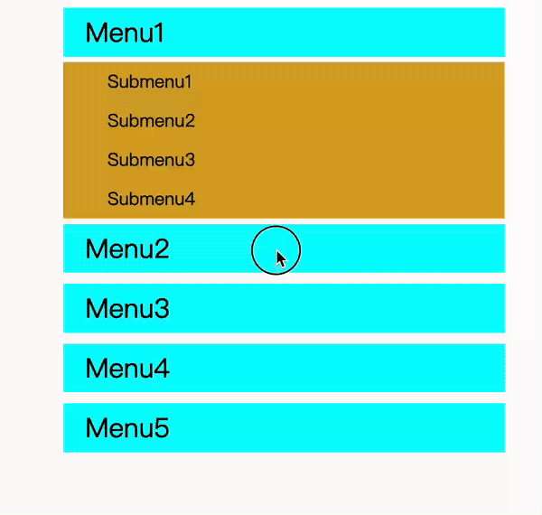
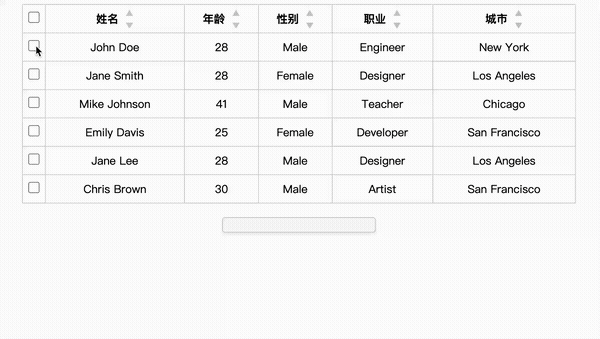
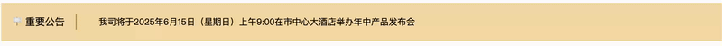

# Frontend Tools

This repository contains a collection of frontend components and tools.

## Menu Accordion

An accordion menu with smooth transitions and customizable options.

### Demo



## Dynamic Multilevel Sort Table

### ✨ Features

- 🪧 Display a table containing personel data
- 🔄 Supports checkbox selection for each row and a select-all feature
- ⏸️ Dynamically records and displays the names of selected rows in a container below the table
- 🎯 Provides multi-level sorting functionality; clicking the sorting icons (ascending or descending) for each column adjusts the data order accordingly
- 🎨 Uses external div container displaying the selected names.

### 🎬 Demo



## Seamless Vertical Scroll

A lightweight, pure JavaScript implementation of a seamless vertical scrolling announcement component. Perfect for displaying important notices, news, or updates in a clean and engaging way.

### ✨ Features

- 🪧 Clean two-column layout with title and scrolling content
- 🔄 Seamless infinite vertical scrolling
- ⏸️ Smart pause on hover functionality
- 🎯 Smooth scroll animations
- 🎨 Customizable styling with minimal CSS
- 📱 Responsive design

### 🎬 Demo




### 🎨 Styling

The component comes with a clean, minimal design:
- Beige background (#f8deae)
- Vertical separator between title and content
- Configurable font sizes (18px for title, 16px for content)

### 🚀 Usage

1. Include the CSS and JavaScript files in your project
2. Add the HTML structure to your page
3. The scroll will initialize automatically

### ⚙️ Configuration

You can adjust the following parameters in the JavaScript:
```javascript
var mainDuration = 1500; // Interval between scrolls
var total = 300; // Animation duration
```
